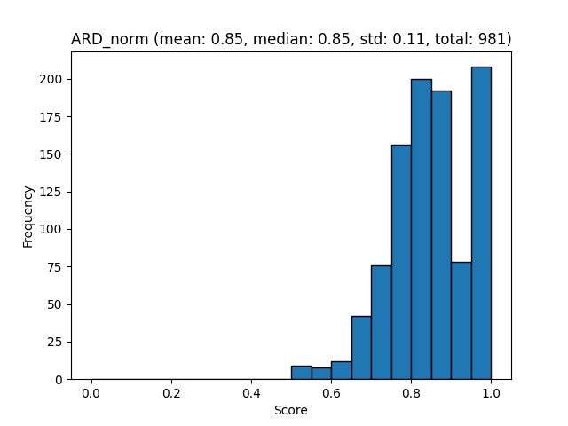
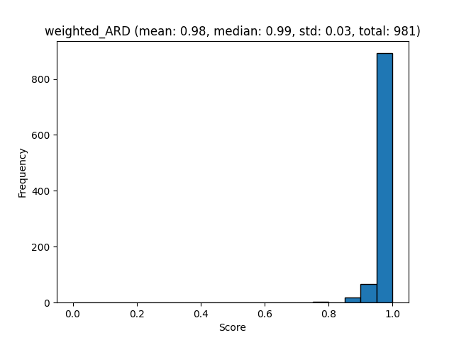
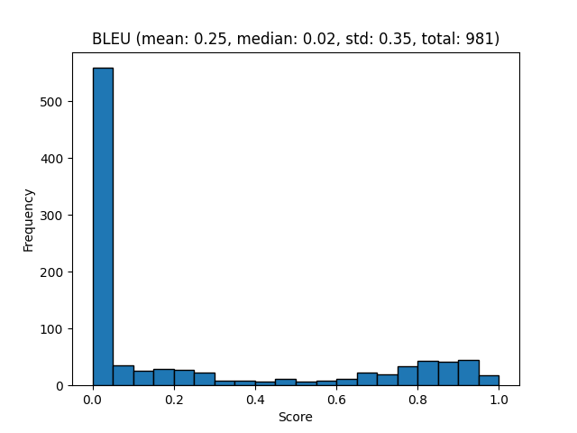

# OmniDocBench

Create and evaluate OmniDocBench using a single command:

```sh
poetry run python ./docs/examples/benchmark_omnidocbench.py
```

This command downloads runs the evaluations and produces the following files:

## Layout Evaluation

<!--
<details>
<summary><b>Layout evaluation</b></summary>
<br>
-->

[Layout evaluation json](evaluations/OmniDocBench/evaluation_OmniDocBench_layout.json)

[mAP[0.5:0.95] report](evaluations/OmniDocBench/evaluation_OmniDocBench_layout_mAP[0.5_0.95].txt)

![mAP[0.5:0.95] plot](evaluations/OmniDocBench/evaluation_OmniDocBench_layout_mAP[0.5_0.95].png)

<!--
</details>
-->

## Layout Evaluation

<!--
<details>
<summary><b>Tableformer evaluation</b></summary>
<br>
-->

[Tableformer evaluation json](evaluations/OmniDocBench/evaluation_OmniDocBench_tableformer.json)


[TEDS struct only report](evaluations/OmniDocBench/evaluation_OmniDocBench_tableformer_TEDS_struct-only.txt)


[TEDS struct with text report](evaluations/OmniDocBench/evaluation_OmniDocBench_tableformer_TEDS_struct-with-text.txt)

<!--
</details>
-->

## Reading order Evaluation

<!--
<details>
<summary><b>Reading order evaluation</b></summary>
<br>
-->

[Reading order json](evaluations/OmniDocBench/evaluation_OmniDocBench_reading_order.json)



[ARD report](evaluations/OmniDocBench/evaluation_OmniDocBench_reading_order_ARD_norm.txt)



[Weighte ARD report](evaluations/OmniDocBench/evaluation_OmniDocBench_reading_order_weighted_ARD.txt)

<!--
</details>
-->

## Markdown text evaluation
<!--
<details>
<summary><b>Markdown text evaluation</b></summary>
<br>
-->

[Markdown text json](evaluations/OmniDocBench/evaluation_OmniDocBench_markdown_text.json)



[BLEU report](evaluations/OmniDocBench/evaluation_OmniDocBench_markdown_text_BLEU.txt)

<!--
</details>
-->
